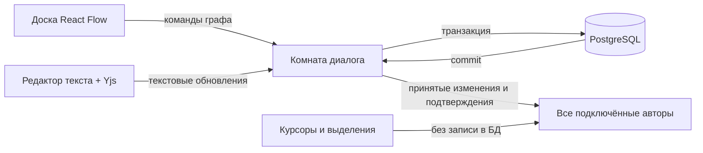

# Архитектура Nodic v1

Основание: [согласованная спецификация](specs/nodic-v1.md), [словарь](../CONTEXT.md), [решение о синхронизации](adr/0001-collaboration-and-storage.md). Это технический план реализации; текущее состояние приложения описано в [границах рабочего среза](first-slice.md).

## Выбранный стек

| Часть | Выбор | Назначение |
| --- | --- | --- |
| Веб-интерфейс | React + TypeScript + Vite | Доска, проекты, диалоги, персонажи |
| Доска | React Flow (`@xyflow/react`) | Ноды, связи, выделение, масштаб, миникарта |
| Полный текст | CodeMirror 6 + стабильный `y-codemirror.next` | Модальный редактор с курсорами коллег и совместным вводом |
| Совместный текст | Yjs 13 | Объединение текстовых операций, персональная отмена |
| Сервер | Node.js + TypeScript + Fastify + `@fastify/websocket` | Проверка прав, команды графа, комнаты совместной работы |
| Постоянные данные | PostgreSQL | Проекты, персонажи, граф, журнал текстовых обновлений и подтверждения операций |
| Проверки | Vitest + Playwright | Публичные операции графа и сценарии в независимых браузерных контекстах |

Один репозиторий, один серверный процесс приложения и одна база в первом развёртывании. Микросервисы и Redis не нужны для целевого масштаба. Версии приложения фиксируются lock-файлом при создании каркаса; проверенный прототип содержит Yjs 13.6.32. Не смешивать Yjs 13 со сменившей API экспериментальной веткой Yjs 14.

## Поток изменений

Граф и текст используют разные способы согласования, но одна сессия редактирования управляет подключением, очередью и историей действий. Команда содержит уникальный идентификатор; повтор после переподключения возвращает прежний результат вместо повторного выполнения.

«Сохранено» появляется только после подтверждения записи в PostgreSQL. Получение сообщения WebSocket, локальная транзакция Yjs или совпадение копий не являются доказательством сохранения.

## Модули и их интерфейсы

| Модуль | Что видит вызывающий код | Что скрыто внутри |
| --- | --- | --- |
| Project access | Создать проект, обменять ссылку на сессию, проверить действие | Роли владельца/редактора, хранение хешей секретов, будущая привязка аккаунта |
| Dialogue session | Открыть диалог, подписаться на состояние, выполнить команду, открыть текст, отменить/повторить | Очереди, подтверждения, повтор доставки, единая история вкладки |
| Graph | Применить команду к актуальному графу и получить результат либо причину отказа | Правила связей, версии полей, удаление и восстановление, обратные команды |
| Collaborative text | Открыть текст ноды, получить совместный документ, синхронизировать обновления | Yjs, загрузка/уплотнение журнала, связь с жизненным циклом ноды |
| Board | Отобразить проекцию диалога и передать намерения автора | React Flow, положение камеры, миникарта, локальное выделение |

Не создавать отдельный публичный интерфейс под каждую таблицу. Правила графа реализуются один раз и вызываются сервером; предварительная проверка в браузере нужна для обратной связи, окончательное решение остаётся за сервером.

## Данные и границы синхронизации

- `Project` владеет диалогами и персонажами. `Dialogue` владеет нодами и связями.
- Нода имеет стабильный идентификатор, тип, положение, ссылку на персонажа и состояние удаления. Тип после создания не меняется в первой версии.
- Связь ссылается на две ноды одного диалога. Единственное начало создаётся вместе с диалогом и не удаляется отдельно.
- Координаты одного перемещения применяются атомарно. Групповое перемещение — одна команда и один шаг отмены. Промежуточное движение курсора/перетаскивание можно транслировать как временное присутствие, итог фиксируется командой.
- Предварительный выбор: отдельный Yjs-документ текста на ноду. Полные документы загружаются при редактировании; доска получает сохранённые превью. Это ограничивает загрузку полных текстов на 1 000 нодах. Прототип проверил один такой документ; стоимость множества документов ещё не измерена.
- Проекция превью и бинарное обновление текста записываются согласованно. Для восстановления Yjs нужны бинарные данные, одной строки текста недостаточно.
- Справочник персонажей обновляется командами проекта. При удалении ссылки в репликах очищаются транзакционно; события обновления получают все открытые диалоги.
- Удалённая нода сохраняет текст. Обновления, уже отправленные из ранее открытого редактора, не должны воскрешать её, но могут попасть в сохранённый текст. Открыть новый редактор удалённой ноды нельзя.
- Хранение удалённых текстов ограничивается политикой очистки позднее; первая версия не очищает их в течение активных сессий отмены. Безопасная очистка — отдельная работа, не таймер наугад.

## Конкурентные изменения и отмена

Структурные команды одного диалога проверяются последовательно. В PostgreSQL транзакция блокирует запись диалога перед чтением и изменением его графа; это сохраняет правила даже при нескольких соединениях с БД. Серверный обработчик комнаты сериализует подтверждения и трансляцию.

Если Аня добавляет обычное продолжение, а Борис одновременно добавляет вариант, принимается первый допустимый запрос. Второй получает понятный отказ и актуальное состояние. Сервер не сохраняет недопустимый смешанный граф.

Отмена текста использует происхождение локальной транзакции Yjs. Для перемещения обратная команда проверяет версию положения: если оно уже изменено коллегой, отмена пропускается с объяснением. Для восстановления связей повторно проверяются живые концы и правила графа; конфликтующие связи не возвращаются молча.

Единая история текста и структуры должна хранить порядок действий, а не переключать два независимых обработчика Ctrl+Z по фокусу. В прототипе проверены простые действия; группировка набора, повтор удаления, составное копирование/вставка и переходы между текстами требуют проверки в рабочем срезе.

## Переподключение и сохранение

При разрыве соединения ввод блокируется. Ожидающие текстовые обновления и команды остаются в очереди; после подключения сервер повторно проверяет доступ, отправляет принятые версии и обрабатывает неподтверждённые идентификаторы. Клиент различает ожидание, отказ и подтверждённую запись.

Для защиты от закрытия вкладки очередь рабочего приложения сохраняется в IndexedDB с привязкой к проекту и сессии. Это техническая защита уже введённых данных, а не доступный пользователю офлайн-режим. Прототип хранит очередь только в памяти и не подтверждает этот механизм.

Критический сценарий: сервер записал операцию, но соединение пропало до ACK. Повтор не должен дублировать ноду или текст. Второй сценарий: процесс упал после записи, но до трансляции; переподключившиеся авторы должны получить записанное состояние из БД.

## Ссылки и будущие аккаунты

Проект имеет разные секреты редактора и владельца. Сервер хранит хеши, проверяет роль и выдаёт сессию проекта. Обладатель обычной ссылки не может удалить проект или диалог через прямой запрос. Стартовая страница не перечисляет чужие проекты.

Секрет ссылки передаётся при обмене на сессию и убирается из адреса; он не является идентификатором пользователя. Будущий вход по почте привяжет права к аккаунту через тот же Project access. Секреты не попадают в присутствие коллег и журнал действий.

## Первый рабочий срез

1. Каркас клиента, сервера и БД; миграции; создание проекта и одного диалога с началом; запуск и проверки одной командой проекта.
2. Две независимые браузерные сессии редактируют текст одной реплики через настоящий WebSocket, видят курсоры и получают подтверждение сохранения. Перезагрузка клиента и сервера сохраняет результат.
3. Команды создания/соединения/удаления нод с конкурентной проверкой правил. Персональная отмена между текстом и структурой.
4. Доска с четырьмя типами нод, модальный редактор, миникарта, групповая работа; затем проекты, диалоги и персонажи.
5. Профиль нагрузки: 1 000 нод и 10 подключений. Измерить загрузку доски, задержку доставки и подтверждения, отзывчивость перемещения и расход памяти. Оптимизировать по результатам, не объявлять нагрузку пройденной по числу элементов в массиве.

## Первичные источники

- [Yjs: обновления документа](https://docs.yjs.dev/api/document-updates) — обмен бинарными обновлениями и векторами состояния.
- [Yjs: персональная отмена](https://docs.yjs.dev/api/undo-manager) — ограничение истории происхождением транзакций.
- [CodeMirror binding](https://github.com/yjs/y-codemirror.next) — совместный редактор и предупреждение о стабильной ветке Yjs 13.
- [React Flow: производительность](https://reactflow.dev/learn/advanced-use/performance) — подписки на состояние и мемоизация для больших досок. При реализации отдельно измерить эффект отрисовки только видимых элементов.
- [Fastify WebSocket](https://github.com/fastify/fastify-websocket) — интеграция WebSocket с сервером.
- [PostgreSQL: конкурентные транзакции](https://www.postgresql.org/docs/current/transaction-iso.html) — ограничения уровней изоляции и блокировки при обновлениях.
