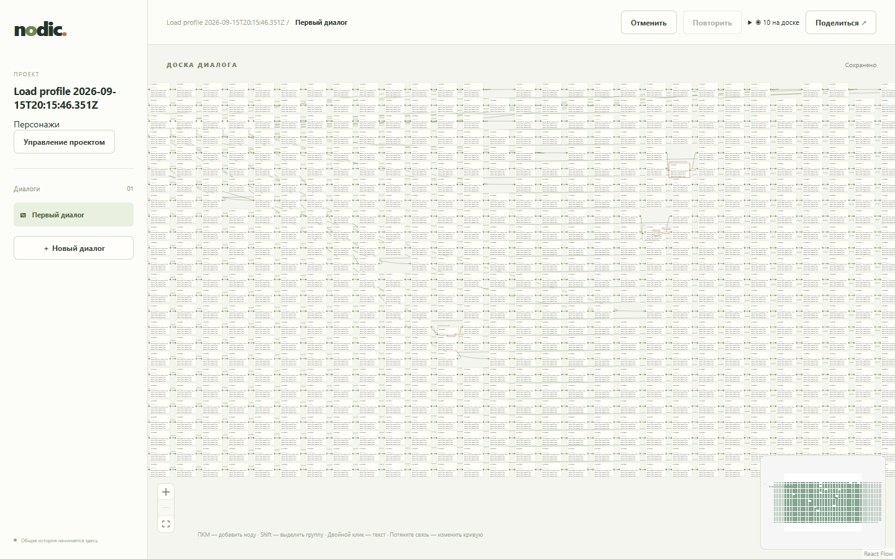

# Профиль 1 000 нод / 10 авторов

## Воспроизведение

Запустить PostgreSQL по README, затем `npm run build`. В отдельной оболочке установить `PUBLIC_ORIGIN=http://127.0.0.1:3001` и выполнить `npm start`. Выполнить `npm run profile:load`; для установленного Edge задать `PLAYWRIGHT_CHANNEL=msedge`. Иной origin задаётся `PROFILE_ORIGIN`, число раундов — `PROFILE_ROUNDS` (по умолчанию 10), JSON — `PROFILE_OUTPUT` (по умолчанию `test-results/load-profile.json`). Снимок доски: `test-results/load-profile.png`.

Профиль создаёт собственный проект и удаляет только его через публичный API в `finally`. Использовать отдельную локальную тестовую базу. Нет SQL-подготовки или проверок таблиц. Все измерения идут через production-клиент, HTTP, настоящие WebSocket-соединения и DOM.

## Методика и бюджеты

Бюджеты выбраны до интерпретации результатов: p95 загрузки ≤ 5 s (разумное ожидание открытия большого диалога), ACK ≤ 250 ms и доставки ≤ 300 ms (отзывчивое совместное редактирование в локальной сети), интервала кадра при перемещении ≤ 50 ms (не более двух пропущенных кадров при 60 Hz), JS heap страницы ≤ 150 MiB (десять страниц укладываются примерно в 1.5 GiB управляемой памяти). Это инженерные ориентиры для регрессий, не обещание SLA.

- 1 нода начала, 999 реплик по 191–193 символа, 998 связей цепочкой; сетка 40 колонок. Подготовка через публичную команду вставки, вне времени загрузки.
- Десять независимых контекстов одного браузера, каждый отображает 1000 DOM-нод и имеет свою сессию/соединение. Загрузка последовательная; время от `goto` до «Сохранено», 1000 DOM-нод и двух requestAnimationFrame. Девять открытий включают обмен приглашения на сессию; владелец уже авторизован. n=10, поэтому p95 практически максимум; это небольшой baseline.
- 10 раундов по 10 одновременно отправленных перемещений разных нод. Следующий раунд после всех ACK и замеров heap: burst-нагрузка, не равномерный поток.
- 10 раундов по 10 конкурентных Yjs-вставок в общий текст через публичный WebSocket. Все 10 авторов подписаны на текст; это протокольная нагрузка при открытой браузерной доске, а не скорость набора CodeMirror.
- 20 настоящих pointer-gestures по очереди через React Flow и IndexedDB; остальные авторы подключены. Gesture duration включает восемь искусственных Playwright steps и ожидание «Сохранено»; для него нет бюджета. Интервалы requestAnimationFrame собираются только во время gesture.
- ACK от вызова WebSocket.send до входящего saved, доставка от того же send до входящего positions/text-update каждого из девяти коллег. Это доставка протокола, не время отрисовки коллеги. Используется performance.timeOrigin + performance.now на одном хосте. Проверяется каждый ACK и доставка каждому коллеге; пропуск завершает запуск ошибкой.
- Heap: Runtime.getHeapUsage.usedSize, 10 страниц × 10 раундов без принудительного GC. Это JS heap страницы, не RSS всего браузера, GPU, сервера или PostgreSQL. Инструмент не удерживает полные graph-снимки после получения, только их размеры; начальный ready и короткий журнал протокола остаются в памяти.
- Перцентили nearest-rank, исходные числовые выборки и агрегаты сохранены в JSON. Локальный loopback без искусственной задержки/потерь, CPU и память браузера, API и PostgreSQL на одном компьютере. Нельзя переносить результаты на 10 физических устройств или WAN. Короткий запуск не доказывает отсутствие утечек. Успешный exit означает полноту ACK/доставки и прохождение сценария, а не соблюдение бюджетов.

## Результаты

Два полных успешных запуска 2026-09-15: [исходные выборки №1](load-profile-run01.json), [№2](load-profile-run02.json). Окружение: Windows 10.0.19044, Intel Core i5-12400 (12 логических CPU), 31.82 GiB RAM, Node 24.20.0, Edge 153.0.4234.32 headless, PostgreSQL 17.4 в локальном тестовом кластере на 55432. API и production-сборка на 3009, без CPU/network throttling. Версии React 19.3.0, React Flow 12.11.6, Vite 8.3.0, клиентский JS 892.76 kB / gzip 279.19 kB. Production-код соответствует коммиту `fc7e59b`; изменения 09 только добавляют инструмент и документы. Vite предупреждает о чанке >500 kB; локальная загрузка при этом укладывается в бюджет, влияние холодной WAN-загрузки здесь не измерялось.

| Метрика                           | n за запуск |    №1 p50 / p95 |    №2 p50 / p95 |            Бюджет p95 |
| --------------------------------- | ----------: | --------------: | --------------: | --------------------: |
| Открытие доски, ms                |          10 |     1226 / 1787 |     1124 / 1745 |       ≤5000: проходит |
| ACK движения, ms                  |         120 |    4564 / 10400 |    4408 / 10376 | ≤250: **не проходит** |
| Доставка движения, ms             |        1080 |    4294 / 10151 |    4300 / 10037 | ≤300: **не проходит** |
| ACK текста, ms                    |         100 |     1850 / 4081 |     1878 / 3467 | ≤250: **не проходит** |
| Доставка текста, ms               |         900 |     1452 / 3559 |     1449 / 3008 | ≤300: **не проходит** |
| Pointer gesture → «Сохранено», ms |          20 |     5422 / 6045 |     5457 / 6203 |              не задан |
| Интервал кадра gesture, ms        | 1025 / 1036 |    16.8 / 483.3 |    16.7 / 483.4 |  ≤50: **не проходит** |
| JS heap страницы, MiB             |         100 |   133.0 / 210.7 |   159.8 / 220.7 | ≤150: **не проходит** |
| Полный graph payload, bytes       |         120 | 632123 / 632124 | 632125 / 632125 |       диагностический |

Во всех 240 перемещениях и 200 обновлениях текста за два запуска получены ACK и все 2160/1800 ожидаемых доставок девяти коллегам. Профиль завершился без ошибок; собственные проекты удалены через API. До финальных запусков исправлены только ошибки измерительного инструмента: удержание всех graph-снимков и попытка тащить стартовую ноду за пределами видимой области. Калибровки не входят в таблицу.

**Статус производительности 1000/10: blocked.** Измерение 09 завершено, однако отзывчивость v1 не подтверждена. Короткий прогон показывает заметные задержки и пропуски кадров; нельзя объявлять v1 готовым к заявленной нагрузке на основании одной успешной загрузки.

## Отложенные задачи — не исполнять

**Оптимизация отложена бессрочно. Задачи 12 и 13 не исполнять.** По указанию пользователя от 2026-09-15 карточки сохранены только как справочный материал и исключены из активной очереди; приоритет P1 снят. Не исследовать, не планировать, не реализовывать, не публиковать их и не повторять нагрузочный профиль в рамках этих задач. Не предлагать их следующим шагом. Возобновление — только по новому явному указанию пользователя вернуться к оптимизации или соответствующей задаче.

- [12. Стоимость рассылки графа](../tasks/12.md), отложена: движение отправляет полный снимок ~632 KB каждому из 10 авторов (~6.3 MB на операцию), затем отдельные positions. Измерить вклад очереди/COMMIT/сериализации, перейти к компактным изменениям с сохранением надёжности.
- [13. Кадры и память](../tasks/13.md), отложена: локализовать CPU/React/DOM-затраты, уменьшить работу при presence/изменении отдельных нод, проверить длительный режим. Точный вклад каждого узкого места пока не установлен; полная рассылка не объявляется единственной причиной.

GitHub Issues проверены: открыта только #1. Автоматическая проверка разрешений отклонила создание issue из карточки 12: публикация локального документа с внутренними измерениями/деталями реализации сочтена неавторизованным внешним раскрытием. Публикация 12/13 не повторялась; позднейшим указанием пользователя задачи и их публикация отложены бессрочно.

